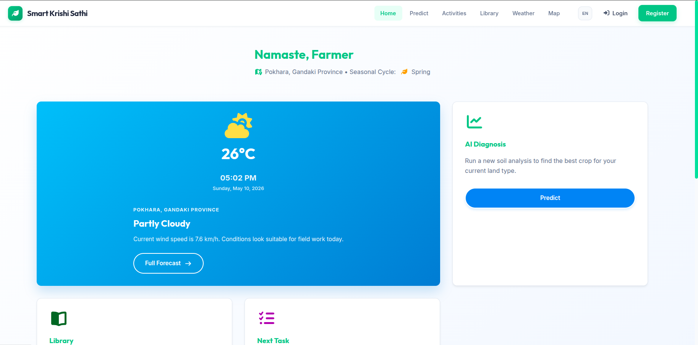
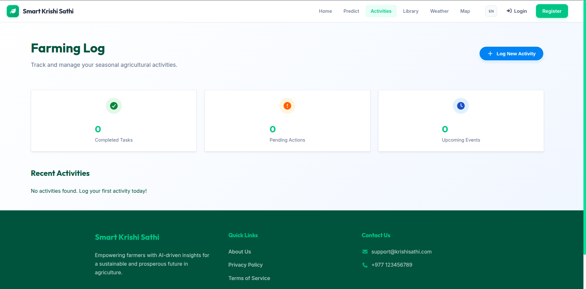

# 🌱 Smart Krishi Sathi - Digital Farming Assistant

[](https://reactjs.org/)
[](https://www.djangoproject.com/)
[](#)

**Smart Krishi Sathi** is a comprehensive full-stack web application designed to empower farmers with modern technology. It provides a suite of tools including AI-powered crop prediction, weather forecasting, educational resources, and activity tracking to improve agricultural productivity and sustainability.

---

## 📸 Screenshots

|                    Landing Page                    |           Farming Log & Activity Tracker           |
| :------------------------------------------------: | :------------------------------------------------: |
|  |  |

---

## 🚀 Key Features

- **🤖 AI-Powered Crop Prediction:** Get data-driven crop recommendations based on soil (NPK) and environmental parameters.
- **📅 Activity Tracker:** Log daily farming activities, plan tasks, and monitor progress throughout the seasonal cycle.
- **📚 Agricultural Library:** Access a curated collection of articles, videos, and guides on modern farming practices.
- **🌦️ Live Weather Updates:** Real-time weather data and forecasts tailored to your location.
- **🗺️ Interactive Map:** GIS-based visualization for farming data and location-specific insights.
- **🇳🇵 Bilingual Support:** Fully accessible in both **English** and **Nepali**.

---

## 🛠️ Tech Stack

### Frontend

- **Framework:** React.js (Vite)
- **Styling:** Custom CSS (Modern, Responsive Design)
- **Animations:** Framer Motion
- **Icons:** Lucide React
- **Maps:** Leaflet

### Backend

- **Framework:** Django (Python) & Django REST Framework (DRF)
- **Database:** SQLite (Development) / PostgreSQL (Production ready)
- **AI/ML:** Scikit-learn (Random Forest/SVM models)
- **Authentication:** JWT / Token-based

---

## ⚙️ Installation & Setup

### Prerequisites

- Python 3.8+
- Node.js 16+
- npm or yarn

### 1. Clone the Repository

```bash
git clone https://github.com/your-username/smart-krishi-sathi.git
cd smart-krishi-sathi
```

### 2. Backend Setup

```bash
cd backend
python -m venv venv
source venv/bin/activate  # On Windows: venv\Scripts\activate
pip install -r requirements.txt
python manage.py migrate
python manage.py runserver
```

### 3. Frontend Setup

```bash
cd ../frontend
npm install
npm run dev
```

---

## 📂 Project Structure

```text
├── backend/            # Django API & ML Models
│   ├── ai/             # Trained .pkl models
│   ├── apps/           # Modular Django apps (accounts, activities, crops, etc.)
│   └── config/         # Project settings
├── frontend/           # React Application
│   ├── src/
│   │   ├── components/ # Reusable UI components
│   │   ├── i18n/       # English & Nepali translations
│   │   └── pages/      # Home, Predict, Weather, etc.
└── assets/             # Images and documentation assets (screenshot folder)
```

---

## 🛡️ Security & Access

- **Public:** Home, Weather, and Library pages are open to all.
- **Private:** Prediction tools and Activity logs require a secure user account.

## 📄 License

This project is developed as part of a **Final Year Project (FYP)**. All rights reserved.

---

_Developed with ❤️ for the farming community._
